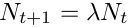

# BIOL 3295 Lab 3: Is flour beetle growth density-dependent?

Lab report due: Wed Oct 8 at 2pm

An adult flour beetle (_Tribolium castaneum_)

Goal:
- The goal of this lab is to use model fitting and statistics to determine if flour beetle (Tribolium castaneum) population growth is density-dependent.


## Flour beetle data
Data from the article `Ghosts of habitats past: environmental carry-over effects drive population dynamics in novel habitat' by Benjamin G. van Allen and Volker H. W. Rudolf.

(1) Download the file `Tribolium.csv' and save it somewhere you will be able to find it again.

(2) Open the file in Microsoft Excel to see what the data look like. Do not make any changes to the saved data.

## Density dependence during the first 60 days of flour beetle growth
We know that during the early stages of growth, a population may not yet show density dependence, and will be growing in size geometrically. We will test this with the flour beetle data.

(3) Download the file “FlourBeetle_First60.R”. Open this file in RStudio. 

(4) The code is, for the most part, completely written already, however, you will need to specify the correct path to the file Tribolium.csv (typing the command getwd() into the console may help you to do this). Once you have corrected the path, all you need to do is to click ‘Source’ in RStudio and a graph will be generated.

The graph you see is data from the flour beetle experiment (circles) and geometric growth ( the red line) with the value of ? equal to lambda1 and a Beverton-Holt model (the blue line) with ? equal to lambda2 and the carrying capacity given by K. For reference, the discrete time exponential model is,


and the Beverton-Holt model is,



Finding the parameter values that correspond to a ‘best’ fit
You can change these values of lambda1, lambda2, and K, to correspond to parameterizations of the population growth models that better fit the data. You should do this now: change the values of the model parameters to give the best possible fit for each model to the data. Usually, this step is automated and the best fit is calculated by an algorithm, however, I am having you do it manually to help you understand: 1) the effect of changing the parameters on the predictions of each model; and 2) how statistical models are fit. For each parameter value that you try, the fit is quantified in the code. You can recover the measure of the fit by typing: LL.Exp and LL.BH into the console. These are the log likelihoods for the respective models and the larger the value of the log likelihood, the better the fit of the model to the data. Note that the log likelihoods are negative, and so a larger value means a less negative number.

The likelihood ratio test
When you have estimated the ‘best fit’ values of lambda1, lambda2, and K, the question we would like to use statistics to answer is, ‘does the data shows evidence of density dependence?’. To do this, we calculate the likelihood ratio test statistic. This test statistic can be recovered by typing Lik.Test.Stat into the console.
 
Our null hypothesis is that the data were generated from a discrete time exponential growth model (i.e. no density dependence). Our alternative hypothesis is that the data were generated from a Beverton-Holt model (with density dependence). If the likelihood ratio test statistic is less than qchisq(0.95,1) = 3.84, the probability that the data were generated under the null hypothesis exceeds ?=0.05 and we fail to reject the null hypothesis (that the data were generated from a discrete time exponential model).  When the test statistic is greater than 3.84 we are able to reject the null hypothesis.

The statistical test we are performing is called the likelihood ratio test and this test is appropriate because the discrete time exponential and the Beverton-Holt models are nested (meaning that the models are the same model when the carrying capacity for the Beverton-Holt approaches infinity). 

Remember to save and label the axes on your graph before moving on to the next part of this lab.

Density dependence during the full 133 days

* Download the file “FlourBeetle_Full.R”. Open this file in R studio.

Again, you need to specify the correct path to Tribolium.csv, but once you have done so, the file should run by clicking ‘Source’. This second code file, and the interpretation of the statistics, are the same as was described in the previous section (Density dependence during the first 60 days of flour beetle growth).

For this second code file, you should:
* Change the parameter values lambda1, lambda2, and K,  to find the values that correspond to the ‘best fit’ for each of the population growth models.

* You should output and interpret the statistical analysis.

Remember to label and save your graph.

Testing for density dependence using a linear regression

Estimating the discrete time geometric growth rate, ?, from the flour beetle data
If the data follow the assumptions of a discrete time exponential model, then the geometric growth rate, ?, does not depend on population size. We will use the flour beetle data to estimate ? and then we will plot ? versus the population size to visualize any relationship between these variables. We will perform a linear regression on the estimated ? against population size and to be consistent with the assumption of no density dependence, the slope of the linear regression should be zero.

Measurements for the flour beetle data were taken every 19 days. Therefore, in the discrete time model, the time step is 19 days. We estimate ? from the data by calculating Nt+1/Nt. For example, if the population size on day 19 is 6 and on day 38 is 12 we get an estimate of ? as 12/6=2, corresponding to the population size of 6. More estimates of ? and their corresponding population sizes arise for the population size estimated at other points in time and from other replicates of the experiment.

* Download the files “FlourBeetle_LinearRegression.R” and “FlourBeetle_LinearRegression_Full.R”

These files correspond to the data for the first 60 days and the full 133 days. Once you have correctly specified the path you can run the files by clicking ‘Source’.

The linear regression
If you want to see the results of the linear regression, you should type summary(reg.model)into the console. If the p-value corresponding to the slope of the linear regression is less than ?=0.05 then you can reject the null hypothesis that the slope of the regression is zero. (Note that for these codes the best-fit line is automatically generated using a built-in optimization routine.)

To hand in:
1. A graph showing: i) the flour beetle data for the first 60 days; ii) your “best fit” exponential growth model; and iii) your “best fit” Beverton-Holt model. You must include descriptive axes labels and a figure caption. Your figure caption must include a description of what each symbol or line type shows.

2. A graph showing: i) the flour beetle data for the full 133 days; ii) your “best fit” exponential growth model; and iii) your “best fit” Beverton-Holt model. You must include descriptive axes labels and a figure caption. Your figure caption must include a description of what each symbol or line type shows.

3. A graph showing the estimated geometric growth rate, ?, versus population size for both the first 60 days and the full 133 days. You must include descriptive axes labels and a figure caption. Your figure caption must include a description of what each symbol and line type shows.

4. A 1-2 paragraph Discussion that answers the following questions: i) what were the results of your statistical analyses, and ii) what is the interpretation of your statistical analyses (i.e. does the flour beetle population show density dependence?). You should answer these two questions for the first 60 days of population growth and for the full 133 days and for both the likelihood ratio test and the linear regression methods.


References
Van Allen, B.G., and V.H.W. Rudolf. 2013. Ghosts of habitats past: environmental carry-over effects drive population dynamics in novel habitat. The American Naturalist 181(5): 596-608. http://dx.doi.org/10.1086/670127
Van Allen,  B.G. and V.H.W. Rudolf. 2013. Data from: Ghosts of habitats past: environmental carry-over effects drive population dynamics in novel habitat. Dryad Digital Repository. http://dx.doi.org/10.5061/dryad.t4g3r

